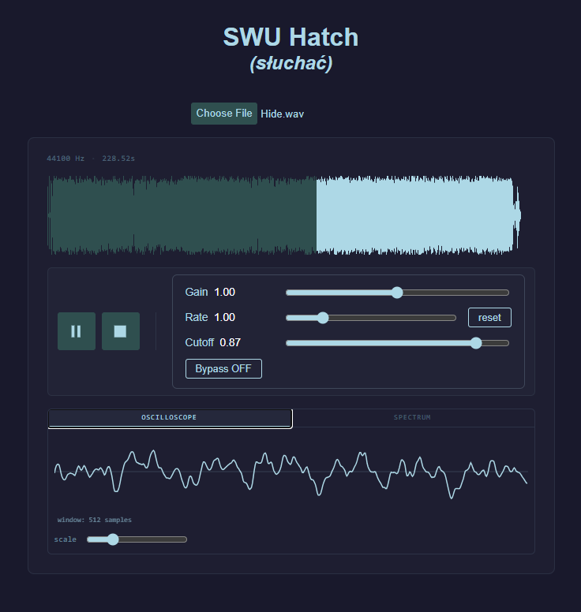

# SWU-Hatch (Sonic Waveform Utility Hatch)
[_słuchać_](https://en.wiktionary.org/wiki/s%C5%82ucha%C4%87): To Hear (Old Polish)

_open the hatch and listen carefully_

A mini project designed to help learn about digital audio processing, and WASM.
The idea is to be able to load and play back audio via the browser, with tools to scrub, pause, play, filter etc.



---

## Prerequisites

1. **[Emscripten](https://emscripten.org/docs/getting_started/downloads.html)** — C++ to WASM compiler
2. **[Node.js](https://nodejs.org/)** — JavaScript runtime (LTS version recommended)
3. **Make** — Build automation tool


## Setup

### 1. Clone this repository

```bash
git clone https://github.com/yourusername/swuhatch.git
cd swuhatch
```

### 2. Clone `dr_libs` (audio decoding library)

The project uses this awesome project [dr_wav](https://github.com/mackron/dr_libs) for WAV decoding. Clone it into the project root:

```bash
git clone https://github.com/mackron/dr_libs.git
```

Your directory structure should look like:
```
swuhatch/
├── dr_libs/
│   └── dr_wav.h
├── src/
├── wasm-build/
├── Makefile
└── package.json
```

### 3. Install Node dependencies

```bash
npm install
```

---

## Build & Run

### 1. Build the WASM module

```bash
make
```

This compiles cpp to wasm using Emscripten.

### 2. Start the development server

```bash
npm run dev
```

---

## Development Workflow

- **Modify C++ code**: Edit c++ code, then run `make` to rebuild
- **Modify JS/HTML**: Changes hot-reload automatically via Vite
- **Clean build artifacts**: `make clean` removes `wasm-build/`

